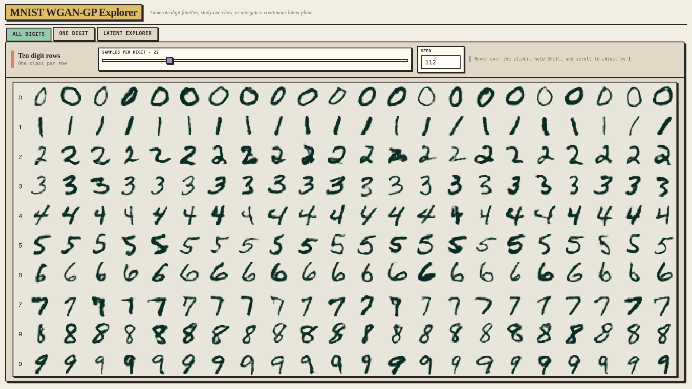
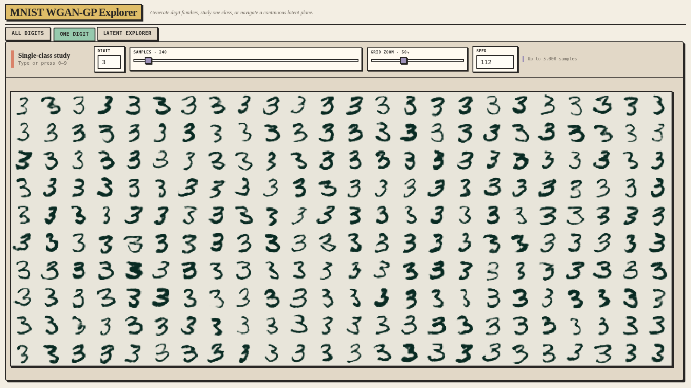
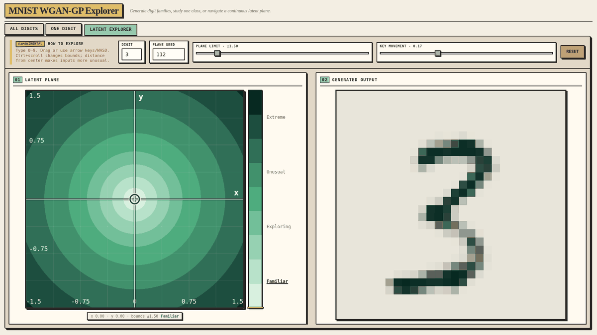

<div align="center">

# MNIST WGAN-GP Explorer

**A project for exploring WGAN-GP conditional generation with MNIST.**

[**Explore the model in your browser →**](https://nicklalo.github.io/mnist-wgan-gp-explorer/)

</div>

<p align="center">
  
  
  <br>
  <em>Compare all ten classes, then zoom out to inspect many variations of a selected digit.</em>
</p>

<br>

<p align="center">
  
  <br>
  <em>Hold the digit class fixed while moving through a two-dimensional slice of latent space, including regions beyond those typically seen during training, to see where the generated digits begin to break down.</em>
</p>

## Features

- **All digits:** generate rows for labels 0–9 in a grid that adapts to the available screen space.
- **One digit:** inspect up to 10,000 variations, adjust density, and zoom out to find rare failures.
- **Latent explorer:** drag, use arrow keys or WASD, and change the visible plane with Ctrl+scroll.
- **Conditional WGAN-GP:** residual generator, projection critic, bounded wrong-label margin, and
  exponential-moving-average (EMA) inference weights.
- **Distribution-aware training:** unpaired feature, diversity, image-statistic, and stroke-integrity
  objectives tuned for MNIST.
- **Tail-aware evaluation:** save a representative grid alongside the samples farthest from each
  digit's real-data manifold.
- **Selective grid cleanup:** keep ordinary samples untouched while replacing only clear class
  mistakes, severe quality outliers, and detached ink artifacts from a small backup pool.
- **Ready-to-explore checkpoint:** launch the interface immediately with the bundled best model.

## Quick start

Run the UI with the bundled checkpoint:

```bash
./run.sh
```

Open [http://127.0.0.1:7860](http://127.0.0.1:7860). The bundled checkpoint is selected
automatically. The script uses `uv` to create or synchronize the environment. To use a checkpoint
stored elsewhere:

```bash
./run.sh --checkpoint /path/to/model.ckpt
```

The linked GitHub Pages demo provides the same three exploration modes using private ONNX
inference inside the visitor's browser—no Python service, uploaded inputs, or server-side model is
involved. Its independent implementation lives in [`browser/`](browser/README.md).

## Train your own model

```bash
uv run mnist-wgan-train
```

Training downloads MNIST into `data/`, creates a reproducible 55,000/5,000 train-validation split,
and runs for 40 epochs by default. The command-line defaults live in
[`cli.py`](src/mnist_wgan/cli.py); model and loss defaults live in
[`module.py`](src/mnist_wgan/module.py).

Common adjustments:

```bash
# Change duration and seed
uv run mnist-wgan-train --epochs 60 --seed 7

# Continue all training state from a Lightning checkpoint
uv run mnist-wgan-train --resume artifacts/checkpoints/last.ckpt

# Inspect every supported option
uv run mnist-wgan-train --help
```

Lightning selects one CUDA device when available and otherwise uses CPU. The default precision is
`16-mixed`; use `--precision 32-true` when full precision is required. Checkpoints are written to
`artifacts/checkpoints/`, fixed-seed progress grids to `artifacts/samples/`, and TensorBoard logs to
`artifacts/logs/conditional_wgan/`. The final state is always saved as `last.ckpt`, and local
artifacts remain excluded from Git. The bundled inference checkpoint omits optimizer and trainer
state, so it cannot be used with `--resume`.

## Evaluate a checkpoint

The UI and evaluator share the same checkpoint selection: they prefer
`artifacts/checkpoints/last.ckpt` after local training, then fall back to the bundled
`checkpoints/mnist-wgan-gp-inference.ckpt`. Pass `--checkpoint /path/to/model.ckpt` to override it.
The bundled file is 12.0 MB and contains the complete model state and hyperparameters needed for
inference and evaluation.

### Explore in the UI

The bundled model runs on CPU. CUDA is selected automatically when available; use `--device cpu`
to choose CPU explicitly.

```bash
uv run mnist-wgan-ui \
  --device cpu \
  --host 127.0.0.1 \
  --port 7860
```

`--host` and `--port` default to `127.0.0.1` and `7860`. If the selected checkpoint is missing,
startup stops with a `Checkpoint not found` error.

### Run quantitative evaluation

```bash
uv run mnist-wgan-evaluate
```

By default, evaluation uses the same local-then-bundled checkpoint selection as the UI, loads EMA
generator weights, and generates 800 samples per digit: 8,000 in total. Choose another checkpoint
or output report with:

```bash
uv run mnist-wgan-evaluate \
  --checkpoint /path/to/model.ckpt \
  --output artifacts/my-evaluation.json \
  --samples-per-digit 800 \
  --seed 112 \
  --device cpu
```

The evaluator compares classifier embeddings against class-balanced samples from the full MNIST
training set, then uses class-balanced MNIST test samples as the real-data calibration set. It loads
the local evaluation classifier from `artifacts/classifier.pt`, or trains and saves it when absent.

Raw checkpoint evaluation is the default. The **All digits** and **One digit** UI views additionally
generate a small backup pool and replace only samples that cross strict class, critic, or detached-
stroke failure checks. This is deterministic for a given seed and intentionally much narrower than
keeping a fixed top percentage. The **Latent explorer** remains unfiltered so it exposes the
generator directly. To audit the UI-like sampling path quantitatively, run:

```bash
uv run mnist-wgan-evaluate --quality-oversample 1.2
```

For an output such as `artifacts/my-evaluation.json`, evaluation writes or replaces:

```text
artifacts/my-evaluation.json
artifacts/evaluation_grid.png
artifacts/evaluation_tail_grid.png
```

The first image is a standard 10-by-10 class grid. The second selects the ten generated samples per
class with the largest distance from the real-class manifold, normalized by its neighborhood radius.

## Run tests

```bash
uv run pytest
uv run ruff check .
```

The tests cover model shapes and gradient flow, loss finiteness and differentiability, core
evaluation metrics, stroke-fragment detection, latent-plane construction, image colors, and dense
grid behavior. They do not currently run a full training job or browser-level UI test.

## How the latent explorer works

The explorer creates a reproducible two-dimensional slice through the generator's latent input for
a selected digit and plane seed.

- The **center is a seeded Gaussian latent sample**, not an all-zero vector.
- Two additional seeded Gaussian vectors are orthogonalized against the center and each other, then
  scaled to the typical radius of the 96-dimensional training input.
- Horizontal and vertical coordinates add those two direction vectors to the center. The selected
  digit label stays fixed.
- Reusing a digit, seed, and x/y coordinate reproduces the same generator input and output.
- Distance is the ordinary straight-line distance from `(0, 0)` in the displayed x/y plane.

The fixed color bands visualize only that input distance:

| Band | Distance from center |
|---|---:|
| Familiar | 0–0.35 |
| Exploring | over 0.35–0.75 |
| Unusual | over 0.75–1.50 |
| Extreme | over 1.50 |

These labels are navigation cues, not measurements of confidence, realism, or uncertainty. Training
samples latent vectors from a standard Gaussian distribution; large plane coordinates add
increasingly strong directional offsets and can expose behavior outside the inputs the model
usually encountered. The absolute color scale remains fixed as the view changes and saturates at
its darkest shade beyond distance 2.5.

Drag the marker or use arrow keys/WASD to move. **Key movement** controls the coordinate change per
keypress. **Plane limit** changes the visible x/y bounds (up to ±10) and clamps the marker to them;
Ctrl+scroll over the plane changes the same limit. Changing the limit does not rescale the color
thresholds or retrain the model. See [`visualize.py`](src/mnist_wgan/visualize.py) for plane
construction and [`index.html`](src/mnist_wgan/static/index.html) for interaction and color bands.

## Evaluation results

The seed-112 evaluation report contains results for 8,000 unfiltered images generated with EMA
weights—800 for each digit.

| Metric | Result | Better | Interpretation |
|---|---:|:---:|---|
| Project-calibrated quality score | **98.75 / 100** | Higher | Weighted, MNIST-specific diagnostic described below |
| Conditional accuracy | **99.94%** | Higher | Samples classified as the requested digit |
| Manifold precision | **94.96%** | Higher | Generated embeddings inside their real-class neighborhood |
| Worst-digit precision | **93.75%** | Higher | Lowest manifold precision among the ten classes |
| Manifold recall | **80.01%** | Higher | Real reference embeddings reached by at least one generated neighborhood |
| Real-manifold coverage | **89.75%** | Higher | Real reference embeddings reached by generated samples |
| Stroke-profile tail | **7.44%** | Lower | Samples outside the central real-data range for width, strength, or centerline extent |
| Fragmented samples | **0.58%** | Lower | Images with over 2% of thresholded ink outside the largest connected stroke |
| Class-wise ink error | **1.59%** | Lower | Mean relative foreground-mass mismatch across classes |

The score combines conditional accuracy (20%), manifold precision (20%), coverage (15%),
classifier-feature Fréchet distance (15%), stroke integrity (20%), and ink calibration (10%). Each
component is normalized against a class-balanced real-MNIST calibration split; the score is useful
for this project but should not be compared directly with unrelated GAN scores.

## Model and training objective

The model combines a conditional Wasserstein objective with distribution-level constraints that
encourage realistic strokes, class fidelity, and within-class diversity.

### Critic objective

The residual projection critic scores image realism plus compatibility between its learned image
features and the requested digit. It is trained with the Wasserstein critic objective, interpolation
gradient penalty, a small score-drift penalty, and a bounded margin between correct and incorrect
labels.

### Generator objective

The residual generator maps a 96-dimensional Gaussian vector and learned label embedding to one
normalized `1 × 28 × 28` image. Its adversarial loss is augmented by class-conditioned,
distribution-level comparisons rather than paired reconstruction.

<details>
<summary><strong>Detailed loss components</strong></summary>

- **Image statistics:** soft intensity histograms, Sobel edge energy, Laplacian detail, and
  class-wise spatial variance.
- **Feature distributions:** sliced Wasserstein distances in critic features and a frozen
  128-dimensional MNIST-classifier embedding.
- **Worst-tail quality:** nearest-real perceptual distance applied to the most distant generated
  embeddings within each class.
- **Diversity:** class-wise matching of low-frequency pair-distance moments between real and
  generated samples; variation is matched rather than maximized without a bound.
- **Stroke integrity:** class-wise ink mass, unsupported local ink, spatial footprint, and
  differentiable connected-stroke statistics.
- **Stroke profiles:** a soft morphological centerline measures per-sample width, ink strength,
  strong-pixel fraction, and centerline extent; sorted class-wise distributions are matched without
  pairing generated handwriting to individual training images.
- **Scheduling:** distribution and diversity terms ramp in over training, and an EMA copy of the
  generator supplies evaluation and UI output.

The distribution losses are unpaired. Generated samples are matched to class-level statistics from
real data rather than being forced to reconstruct individual training images.

</details>

## Reusing parts of the project

The codebase is compact, and its main components are separated by responsibility:

| Component | Source | Contract and scope |
|---|---|---|
| Conditional generator and projection critic | [`models.py`](src/mnist_wgan/models.py) | `z: [N, 96]`, labels 0–9, normalized grayscale output `[N, 1, 28, 28]`; MNIST-specific label count and resolution |
| Lightning training loop | [`module.py`](src/mnist_wgan/module.py) | Manual critic/generator optimization, EMA, Adam, and scheduled auxiliary losses |
| Distribution and stroke losses | [`losses.py`](src/mnist_wgan/losses.py) | Mostly assumes class-labeled, normalized single-channel MNIST-like images; stroke footprint is explicitly 28 × 28-specific |
| Data module | [`data.py`](src/mnist_wgan/data.py) | Downloads MNIST and normalizes pixels to `[-1, 1]` |
| Evaluation metrics and worst-tail selection | [`metrics.py`](src/mnist_wgan/metrics.py) | Uses a project-trained MNIST classifier and class-balanced real/generated batches |
| Evaluation classifier | [`classifier.py`](src/mnist_wgan/classifier.py) | Ten classes, one channel, 128-dimensional feature embedding |
| Selective grid sampling | [`sampling.py`](src/mnist_wgan/sampling.py) | Bounded candidate scoring and conservative replacement for the All digits and One digit UI views |
| Grids and latent-plane construction | [`visualize.py`](src/mnist_wgan/visualize.py) | Tensor-to-image rendering, seeded noise, and orthogonal plane directions |
| Interactive explorer | [`app.py`](src/mnist_wgan/app.py) and [`index.html`](src/mnist_wgan/static/index.html) | Checkpoint inference endpoints and dependency-free browser controls |

The projection pattern and WGAN-GP loop can be adapted more broadly; the evaluator, stroke losses,
class count, and image-shape assumptions are deliberately MNIST-specific.

## Repository structure

```text
src/mnist_wgan/
  app.py             Checkpoint inference and UI endpoints
  callbacks.py       Fixed-seed training sample grids
  classifier.py      Evaluation/perceptual MNIST classifier
  cli.py             Train, evaluate, and UI commands
  data.py            MNIST Lightning data module
  losses.py          Distribution, diversity, and stroke losses
  metrics.py         Calibrated scoring and worst-tail evaluation
  models.py          Conditional generator and projection critic
  module.py          Lightning WGAN-GP training module
  paths.py           Local-to-bundled checkpoint selection
  sampling.py        Conservative UI candidate replacement
  visualize.py       Rendering, seeded noise, and latent plane
  static/            Browser interface and favicon
checkpoints/          Bundled inference checkpoint
docs/assets/          README screenshots and animation
browser/              Static ONNX Runtime application and GitHub Pages build
scripts/              Reproducible browser-model export
tests/                Focused unit tests
artifacts/            Local checkpoints, reports, grids, and logs (Git-ignored)
data/                 Downloaded MNIST files (Git-ignored)
```

## Reproducing the reported result

The metrics above were produced by the model state included in the repository:

- checkpoint: `checkpoints/mnist-wgan-gp-inference.ckpt` (epoch 29, global step 12,412);
- checkpoint size: 12,001,253 bytes;
- SHA-256: `fdb9dd4861ecf114dd8620211a34a5b558a4883d38600fef5e709840f6655975`;
- evaluation seed: 112;
- evaluation samples: 800 per digit, 8,000 total;
- generated weights: EMA;
- reference data: class-balanced samples from the full 60,000-image MNIST training set;
- calibration data: class-balanced samples from the 10,000-image MNIST test set;
- evaluation classifier test accuracy recorded in the report: 99.47%;
- saved report: `artifacts/best_run/evaluation_seed112.json` (local and Git-ignored).

Reproduce the reported evaluation with:

```bash
uv run mnist-wgan-evaluate \
  --checkpoint checkpoints/mnist-wgan-gp-inference.ckpt \
  --output artifacts/best_run/evaluation_seed112.json \
  --samples-per-digit 800 \
  --seed 112
```

<details>
<summary><strong>Retained checkpoint hyperparameters</strong></summary>

```text
latent_dim=96                     base_channels=32
generator_lr=0.00005              critic_lr=0.0001
critic_steps=3                    gradient_penalty_weight=10.0
label_consistency_weight=0.5      label_margin=1.0
histogram_weight=5.0              edge_weight=0.5
detail_weight=0.25                variance_weight=5.0
perceptual_distribution_weight=50.0
perceptual_tail_weight=7.0        perceptual_tail_fraction=0.20
diversity_weight=3.0              diversity_final_weight=2.0
diversity_decay_epochs=21         distribution_start_epoch=0
distribution_ramp_epochs=5        ink_weight=10.0
stroke_support_weight=10.0        class_footprint_weight=5.0
connectivity_weight=5.0           stroke_profile_weight=10.0
ema_decay=0.995
```

</details>

The bundled file preserves the complete model state from the evaluated checkpoint, but its original
end-to-end training command, hardware, runtime, and training seed were not recorded. The historical
training run therefore cannot be reconstructed bit-for-bit. Current training calls
`seed_everything(..., workers=True)`, but Lightning deterministic mode is not enabled and CUDA
benchmarking is enabled when CUDA is available; identical seeds are not a guarantee of identical
weights.

## Outputs

Training creates or updates:

```text
artifacts/checkpoints/epoch-epoch=NNN.ckpt   Periodic Lightning checkpoints
artifacts/checkpoints/last.ckpt              Final checkpoint; replaced by the latest run
artifacts/samples/epoch_NNN.png               Fixed-seed grid after each epoch
artifacts/logs/conditional_wgan/version_N/    Versioned TensorBoard event logs
artifacts/perceptual_classifier.pt            Frozen training-loss classifier, created if absent
```

Evaluation creates or replaces:

```text
artifacts/evaluation.json
artifacts/evaluation_grid.png
artifacts/evaluation_tail_grid.png
artifacts/classifier.pt                       Evaluator classifier, created if absent
```

Change `--artifacts-dir` for a separate training run or `--output` for a separate evaluation JSON.
The two evaluation image names are fixed within the selected output directory and will be replaced.

## Limitations

- MNIST does not demonstrate performance on complex natural images.
- The calibrated score and classifier-feature metrics are specific to this evaluator and inherit
  the evaluation classifier's blind spots.
- Conditional accuracy alone does not establish realism or diversity.
- The All digits and One digit views use selective resampling for presentation. Use the raw
  evaluator or latent explorer when every unfiltered generator output matters.
- A two-dimensional slice covers only a small fraction of the full latent space, and latent distance
  need not correspond to a single semantic handwriting change.
- Large explorer coordinates are deliberate out-of-distribution stress tests; class identity and
  stroke quality are expected to degrade.
- The 28 × 28 stroke and footprint losses require redesign before transfer to another dataset.

## Research basis and adaptations

This is not a literal reproduction of one paper. The table explains which ideas follow prior work,
where this implementation changes those ideas, and which additions were developed for this project.

| Component | Relationship to prior work | Source or design note |
|---|---|---|
| Wasserstein critic objective | Implements the critic objective introduced in the original WGAN paper. | [Wasserstein Generative Adversarial Networks](https://proceedings.mlr.press/v70/arjovsky17a.html) |
| Interpolation gradient penalty | Implements the gradient-penalty approach published as an improvement to WGAN training. | [Improved Training of Wasserstein GANs](https://papers.neurips.cc/paper_files/paper/2017/hash/892c3b1c6dccd52936e27cbd0ff683d6-Abstract.html) |
| Label-conditioned projection critic | Uses the published projection-discriminator method to combine image realism with digit-label compatibility. | [cGANs with Projection Discriminator](https://openreview.net/forum?id=ByS1VpgRZ) |
| Sliced feature-distribution matching | Adapts the published sliced-Wasserstein idea to compare real and generated samples in this model's critic and classifier feature spaces. | Based on [Generative Modeling Using the Sliced Wasserstein Distance](https://openaccess.thecvf.com/content_cvpr_2018/html/Deshpande_Generative_Modeling_Using_CVPR_2018_paper.html) |
| Diversity matching | Takes inspiration from mode-seeking regularization, but replaces unbounded output-distance maximization with matching the amount of variation observed within each real digit class. | Inspired by [Mode Seeking GANs](https://openaccess.thecvf.com/content_CVPR_2019/html/Mao_Mode_Seeking_Generative_Adversarial_Networks_for_Diverse_Image_Synthesis_CVPR_2019_paper.html) |
| Two learning rates and Fréchet-style evaluation | Uses the published two-time-scale principle for separate critic and generator learning rates. It also reuses the Fréchet-distance formulation with MNIST-classifier features instead of Inception features. | [GANs Trained by a Two Time-Scale Update Rule](https://proceedings.neurips.cc/paper/2017/hash/8a1d694707eb0fefe65871369074926d-Abstract.html) |
| Precision, density, recall, and coverage | Uses the published metric definitions, calculated in the project's MNIST-classifier feature space. | [Reliable Fidelity and Diversity Metrics for Generative Models](https://proceedings.mlr.press/v119/naeem20a.html) |
| Bounded wrong-label margin | Designed for this project to encourage correct conditioning without giving the critic an unbounded label-based shortcut; it is not presented as a published method. | Conditional-fidelity guardrail used by this implementation |
| Perceptual worst-tail loss | Designed for this project to target rare malformed samples by applying a nearest-real feature penalty only to the weakest generated tail. | Project-specific training objective |
| Stroke-integrity losses | Designed for this MNIST implementation to match class-wise ink, local support, footprint, and differentiable connectivity statistics. | Project-specific training objectives |
| Soft-centerline stroke profiles | Adapts differentiable morphological skeletonization from soft-clDice, then uses it in an unpaired class-wise distribution loss for stroke width, strength, and extent rather than as a paired segmentation loss. | Adapted from [clDice: A Novel Topology-Preserving Loss Function for Tubular Structure Segmentation](https://openaccess.thecvf.com/content/CVPR2021/html/Shit_clDice_-_A_Novel_Topology-Preserving_Loss_Function_for_Tubular_Structure_CVPR_2021_paper.html) |
| Selective UI resampling | Inspired by discriminator rejection sampling, but does not implement its density-ratio acceptance rule. This project keeps the initial sample set, scores a small backup pool with conditional, critic, and stroke evidence, and replaces only explicit failures. | Conservative project adaptation inspired by [Discriminator Rejection Sampling](https://openreview.net/forum?id=S1GkToR5tm) |
| Calibrated quality score | Designed for this project as a weighted diagnostic normalized against class-balanced real MNIST; it is not a standardized GAN benchmark. | Project-specific evaluation summary |
